<div align="center">



<p>
  <b>A cream on black, red HUD portfolio.</b><br>
  Built in vanilla HTML, CSS and JavaScript. No framework. No template. No build step.
</p>

<p>
  <a href="https://gs-tejas-hub.github.io/Demon-s-Portfolio/"><b>Live site</b></a>
  &nbsp;·&nbsp;
  <a href="https://5am-labs.vercel.app"><b>Five AM Labs</b></a>
  &nbsp;·&nbsp;
  <a href="https://www.linkedin.com/in/g-s-tejas-10580929a/"><b>LinkedIn</b></a>
</p>

</div>

---


## Why a portfolio still matters

A resume tells people what you did. A portfolio shows them how you think.

For anyone who builds, the portfolio is the one piece of the internet you own top to bottom. It is where a recruiter, a founder, or a stranger at 2am decides in eight seconds whether you are worth a reply. Every choice on the page is a signal: the typography, the pacing, the way a cursor behaves, the care in a hover state. A good portfolio does not list skills, it demonstrates them, because the site itself is the proof.

This one is that argument made in code. It is fast, it is handmade, and it ships on GitHub Pages with nothing but three files and a folder of assets. If the site feels alive, that is the point. The medium is the message.

> "If you can't find a reason to code, then you shouldn't be coding."

---

## What is inside

A single page that moves through six acts: a live hero, an about section with real time GitHub stats, a 3D coverflow of favorite anime, a work timeline, a project stack rendered inside laptop mockups, research and recognition, and a contact console. Everything is keyboard reachable, respects reduced motion, and degrades gracefully when a font or an image is missing.

---

## Design system

### Palette

<div align="center">

</div>

| Token | Hex | Where it lives |
| :-- | :-- | :-- |
| Cream | `#ECE7DE` | Primary text, display headings, the name |
| Ink | `#070707` | The page. Deep, matte, never pure black glare |
| Panel | `#0D0D0F` | Raised cards, project stack, alternate sections |
| Accent | `#FF3B3B` | The red. Links, highlights, HUD, every point of tension |
| Deep red | `#7A1414` | Gradient shadows and the aurora sweep |
| Signal | `#6EE787` | Live status, the available dot, anything breathing |
| Tint | `#0E1016` | A `mix-blend-mode: color` grade over the hero fog |

### Typography

Every typeface is chosen for a job. Nothing generic, nothing default.

| Font | Role on the page |
| :-- | :-- |
| **Mona Sans** | The name, most headings, body weight. The spine of the whole thing |
| **Syne** | The preloader words: Building, Shipping, Innovating |
| **JetBrains Mono** | All technical accents. Coordinates, tags, labels, the HUD readout |
| **Cinzel Decorative** | The statement and the closing DESTINY quote. Carved, ceremonial |
| **Noto Sans JP** | The kanji. 鬼 on the oni seal, and one glyph per anime card |
| **Kordix** | The section titles: "Where I have been" and "MY PROJECTS" |
| **DEL THA** | The archive project names in the lab list |
| **Toxia** | "My Top Picks" above the anime coverflow |

NYXERIN and NeoFolia ship in `assets/fonts` and are wired as CSS variables too, ready to drop onto any heading without touching the markup.

---

## The six morphisms

The site is a small museum of surface design. Six ways to make a flat rectangle feel like a physical object, each applied live to a real component and each carrying its own animation. They are additive CSS classes, so any one can be commented out and the element falls back to its base look with zero breakage.

<div align="center">

</div>

| Morphism | Feel | Lives on | Motion |
| :-- | :-- | :-- | :-- |
| **Neumorphism** | Soft extrusion pressed out of the background | Social icons | A toggle knob slides across and flushes red |
| **Glassmorphism** | Frosted translucent glass over a colored blur | Contact form | A diagonal sheen sweeps the surface |
| **Claymorphism** | Puffy, rounded, inflated clay | Research cards | A slow squish, then a lift on hover |
| **Skeuomorphism** | Brushed aluminium control strip | Hero HUD bar | A metal shine passes edge to edge |
| **Auroramorphism** | Flowing conic color glow | Ready to apply anywhere | A gradient halo rotates behind the element |
| **Liquid glass** | Apple style refractive glass | Contact buttons and the cursor | A light streak glides across on a loop |

---

## Signature interactions

- **Liquid glass magnifier cursor.** The native pointer disappears. In its place a refractive lens follows the mouse and magnifies the exact letters underneath it, then clears the moment it hovers empty space.
- **3D anime coverflow.** Eight posters ride a perspective carousel that drifts on its own, snaps color at the center, and responds to drag with real momentum and touch axis locking.
- **A living hero.** A smoke plate rotates so the center stays still while the outer radius sweeps faster, graded toward `#0E1016` with the red glow left untouched. Two counter rotating layers give it turbulence.
- **Live GitHub stats.** Repositories, contributions and pull requests are pulled from public GitHub endpoints on load and counted up in place, so the numbers are never stale.
- **Floating anime quotes.** Lines flash in the gutters like lightning, hold, and fade, drifting upward on their own timing.
- **Orchestrated load.** A clip path preloader, a staggered name reveal, an oni seal that spins into place, and reveal on scroll throughout, all riding Lenis smooth scroll.

---

## Built with


Vanilla HTML, CSS and JavaScript. The only runtime dependency is [Lenis](https://github.com/darkroomengineering/lenis) for smooth scroll, loaded from a CDN. Fonts come from Google Fonts and local `woff2` files. Live numbers use the public GitHub REST and search APIs. Anime art is stored locally under `assets/anime`. That is the entire supply chain.

---

## Run it locally

```bash
git clone https://github.com/GS-Tejas-hub/Demon-s-Portfolio.git
cd Demon-s-Portfolio

# any static server works, for example
python -m http.server 8080
# then open http://localhost:8080
```

Opening `index.html` straight from disk works too. A local server is only nicer because the live GitHub calls and local fonts resolve cleanly.

---

## Structure

```
Demon-s-Portfolio/
├─ index.html          the single page, all six sections
├─ style.css           design system, morphisms, responsive rules
├─ index.js            cursor, coverflow, live stats, reveals
├─ assets/
│  ├─ fonts/           Kordix, DEL THA, Toxia, NYXERIN, NeoFolia
│  ├─ anime/           poster art for the coverflow
│  ├─ hero-bg.jpg      the swirling smoke plate
│  ├─ intro.jpg        the about portrait
│  └─ *.jpg            project screenshots
└─ readme/             the animated SVGs in this file
```

---

<div align="center">

> "When a broken man disappears,,, he rewrites **DESTINY**"
>
> - G S Tejas

<sub>Designed and built at 5am. Not a template.</sub>

</div>
